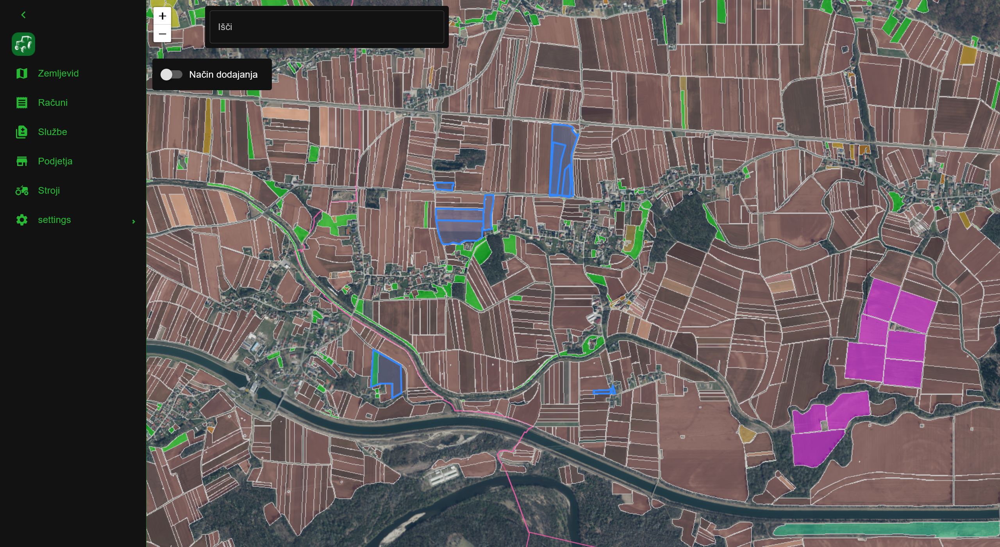
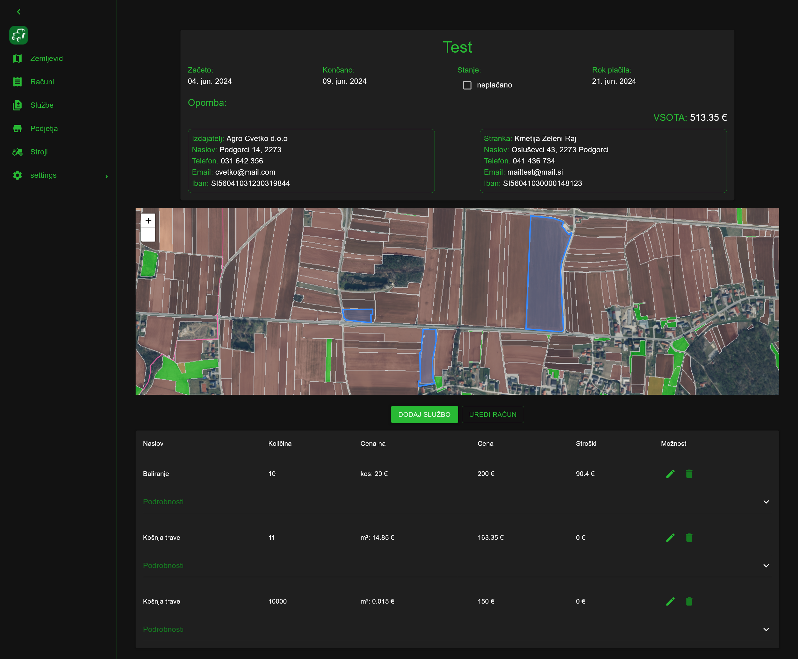

# About Agro Majster Web

Agro Majster web is a web UI for managing your work on fields, be it for yourself
or for others. Helps you keep track of invoices and equipment services, while also
providing informative graphs about your work.

|    |  |
|--------------------------------|-------------------------------------|
|  |         |


## Prerequisites  

To build and run this software you will need:  
    - [Agro Majster rest server](https://github.com/Seljaki/server)  
    - Node version 20+

## Configuring and running the app

1. Rename the ```example.env``` file to ```.env``` and set the IP to the REST server IP
2. Run ```npm install```
3. Run ```npm start```
4. Open [http://localhost:3000](http://localhost:3000)


## Building the app

### Using Dockerfile
**Note: Docker is required for this build type**
1. Edit the ```Dockerfile``` and change server ip environmental variable
2. Run ```docker build .```

## Using node

1. Follow the configuration setting above
2. Run ```npm run build```
3. Serve the output folder ```build``` with a http server
